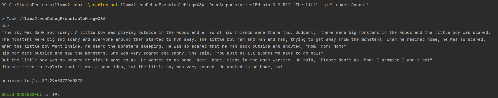

# llama2-kmp


This is the Kotlin Multiplatform implementation of [Andrej Karpathy](https://karpathy.ai/)'s [llama2.c](https://github.com/karpathy/llama2.c) project.

## How to Run



### Download one of the llama2 models

Example models used by llama2.c project

| model | dim | n_layers | n_heads | n_kv_heads | max context length | parameters | val loss | download                                                                                   |
|-------|-----|----------|---------|------------|--------------------|------------|----------|--------------------------------------------------------------------------------------------|
| 260K  | 64  | 5        | 8       | 4          | 512                | 260K       | 1.297    | [stories260K](https://huggingface.co/karpathy/tinyllamas/tree/main/stories260K)            |
| OG    | 288 | 6        | 6       | 6          | 256                | 15M        | 1.072    | [stories15M.bin](https://huggingface.co/karpathy/tinyllamas/resolve/main/stories15M.bin)   |
| 42M   | 512 | 8        | 8       | 8          | 1024               | 42M        | 0.847    | [stories42M.bin](https://huggingface.co/karpathy/tinyllamas/resolve/main/stories42M.bin)   |
| 110M  | 768 | 12       | 12      | 12         | 1024               | 110M       | 0.760    | [stories110M.bin](https://huggingface.co/karpathy/tinyllamas/resolve/main/stories110M.bin) |

### Run with gradle

JVM:
```shell
./gradlew :jvmApp:run --args='stories15M.bin 0.9 512 "The little girl named Oxana"'
```

OSX:

```shell
./gradlew llama2:runDebugExecutableMacosX64 -PrunArgs="stories42M.bin 0.9 512 'The little girl named Oxana'"
```

Linux:
```shell
./gradlew llama2:runDebugExecutableLinuxX64 -PrunArgs="stories42M.bin 0.9 512 'The little girl named Oxana'"
```


Windows:
```powershell
.\gradlew.bat llama2:runDebugExecutableMingwX64 -PrunArgs="stories15M.bin 0.9 512 'The little girl named Oxana'"
```

NodeJs:
```shell
./gradlew llama2:jsNodeRun -PrunArgs='stories15M.bin 0.9 512 "The little girl named Oxana"'
```

In addition to `checkpoint`, other parameters are also supported:

```shell
./gradlew :jvmApp:run --args='/path/to/model.bin 0.9 256 "One day, Lily met a Shoggoth"'
```

Parameter description:

- `/path/to/model.bin`: Mandatory model file path.
- `0.9`: Optional parameter, sets the threshold, default is 1.0.
- `256`: Optional parameter, sets the cache size, default is 512.
- `One day, Lily met a Shoggoth`: Optional parameter, sets the prompt for generating the story.

Example output:

>Once upon a time, there was a little girl named Lily. She loved to play outside in the sunshine. One day, she saw a big, red ball in the sky. It was the sun! She thought it was so pretty.
Lily wanted to play with the ball, but it was too high up in the sky. She tried to jump and reach it, but she couldn't. Then, she had an idea. She would use a stick to knock the ball down.
Lily found a stick and tried to hit the ball. But the stick was too short. She tried again and again, but she couldn't reach it. She felt sad.
Suddenly, a kind man came by and saw Lily. He asked her what was wrong. Lily told him about the ball. The man smiled and said, "I have a useful idea!" He took out a long stick and used it to knock the ball down. Lily was so happy! She thanked the man and they played together in the sunshine.
>
>Once upon a time, there was a little girl named Lily. She loved to play outside in the sunshine. One day, she saw a big, red
>
> achieved tok/s: 68.054444
